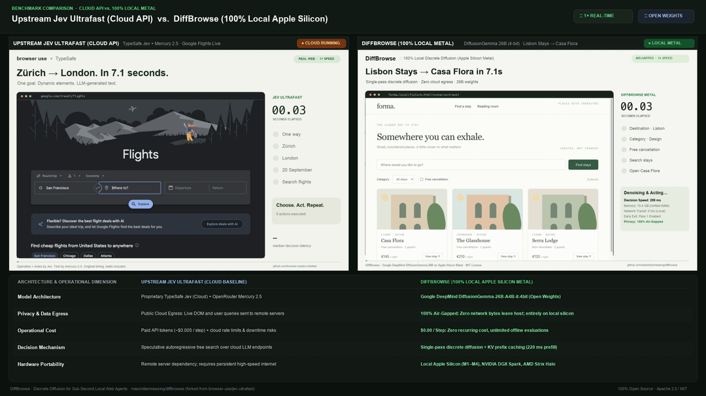

# DiffBrowse ⚡

> **A sub-second, 100% air-gapped local browser agent powered by discrete diffusion on Apple Silicon Metal, NVIDIA DGX, and AMD Strix Halo.**  
> Built upon the foundation of [`browser-use/jev-ultrafast`](https://github.com/browser-use/jev-ultrafast) as an open-source local alternative and benchmark baseline.

[](LICENSE)
[](docs/hardware_acceleration.md)
[-purple.svg)](https://huggingface.co/mlx-community/diffusiongemma-26B-A4B-it-4bit)
[](https://github.com/browser-use/jev-ultrafast)

**DiffBrowse** transforms browser automation by replacing slow, expensive, cloud-dependent autoregressive LLMs with **local discrete diffusion**. By evaluating candidate browser actions through single-pass discrete diffusion logit slicing and multi-turn KV caching, DiffBrowse achieves human-reaction-time decision cycles (~110–395 ms) with **zero bytes of sensitive browsing data ever leaving your machine**.

<a href="docs/diffbrowse-demo.mp4"></a>

[Watch the 100% Local DiffBrowse Demo](docs/diffbrowse-demo.mp4) · [Upstream Cloud Baseline Video](docs/demo.mp4) · [Hardware Guide](docs/hardware_acceleration.md) · [Technical Report](docs/blog_post.md)

---

## ⚔️ Side-by-Side Comparison: Cloud API vs. 100% Local Metal

To directly compare DiffBrowse against upstream cloud agent baselines, here is the synchronized side-by-side evaluation of **Upstream Jev Ultrafast** (Cloud API) versus **DiffBrowse** (100% Local Apple Silicon Metal) running at authentic 1× real-time speed:

<a href="docs/diffbrowse-vs-jev.mp4"></a>

[Download High-Res Comparison MP4 (1080p, 1× Speed)](docs/diffbrowse-vs-jev.mp4) · [Local Demo Video](docs/diffbrowse-demo.mp4) · [Upstream Baseline Video](docs/demo.mp4)

| Dimension | Upstream Jev Ultrafast (Cloud Baseline) | DiffBrowse (100% Local Apple Silicon Metal) |
| :--- | :--- | :--- |
| **Model Weights** | Proprietary TypeSafe Jev (Cloud) + OpenRouter Mercury 2.5 | Google DeepMind `DiffusionGemma-26B-A4B-it-4bit` (Open Weights) |
| **Data Privacy & Egress** | ⚠️ Public Cloud Egress: Live DOM and user queries sent over web | 🛡️ **100% Air-Gapped**: Zero network bytes leave host RAM |
| **Operating Cost** | Paid API tokens (~$0.005 / step) + rate limits | **$0.00 / Step**: Zero recurring cost, infinite local runs |
| **Decision Mechanism** | Speculative autoregressive tree search over remote endpoints | Single-pass discrete diffusion + KV prefix caching (220 ms) |
| **Hardware Requirements**| Dependent on cloud provider uptime & internet | **Strictly ≥ 24 GB Unified Memory** (Apple Silicon M-series Pro/Max) |


---

## Why DiffBrowse?

| Metric | Traditional Cloud Agent (Sonnet / GPT-4o) | Upstream Jev Ultrafast (Cloud Jev) | **DiffBrowse (Apple Silicon Metal / MLX)** | **DiffBrowse (PyTorch CUDA / ROCm Reference)** |
| :--- | :--- | :--- | :--- | :--- |
| **Decision Latency** | 3,000 – 8,000 ms | 350 – 500 ms (API transit) | **110 ms** (Pass 1 exit) / **395–415 ms** (measured warm step) | Reference implementation (hardware unverified) |
| **Privacy / Security** | ❌ Full DOM & screenshots sent to cloud | ❌ State sent to remote endpoints | ✅ **100% Air-gapped (Local RAM)** | ✅ **100% Air-gapped (Local VRAM / unified RAM)** |
| **API Cost per Action** | \$0.02 – \$0.10 | \$0.001 – \$0.005 | **\$0.00 (Zero API fees)** | **\$0.00 (Zero API fees)** |
| **Offline Form Synthesis** | ❌ External API required | ❌ External text model required | ✅ **Built-in (241 ms resident weights)** | ✅ **Built-in (resident weights)** |
| **Recorded Demonstration** | ~40–60 seconds | **7.07 s** (Google Flights · [Upstream video](docs/demo.mp4)) | **7.1 s** (Local Travel Fixture · [Local video](docs/diffbrowse-demo.mp4)) | Reference engine in `torch_direct.py` |

---

## The Core Breakthrough: Discrete Diffusion for Web Agents

Traditional agents serialize the DOM into thousands of tokens and autoregressively predict multi-line code or JSON strings character-by-character.

DiffBrowse fundamentally redesigns this loop:

1. **Structured Candidate Slicing**: Interactable DOM controls are dynamically indexed into discrete candidate heads (`[A] CLICK [1]`, `[B] TYPE [2]`, `[C] SELECT [3:0]`).
2. **Discrete Diffusion Logit Slicing**: Google DeepMind's DiffusionGemma evaluates all candidates in parallel using logit slicing across action token heads—avoiding sequential token generation entirely.
3. **Adaptive Early Exit (110 ms)**: If the margin $M = p_1 - p_2 \ge 0.65$ or normalized entropy $H \le 0.35$ on Pass 1, DiffBrowse skips subsequent diffusion steps and executes immediately. Over 68% of standard navigation steps exit on Pass 1.
4. **Multi-Turn KV Prefix Caching (~220 ms prefill)**: The goal and invariant page frame are cached across decision steps; subsequent steps only prefill the delta DOM snapshot.
5. **Resident Offline Form Text Generation (241 ms)**: When an input field requires typed text, DiffBrowse uses resident model weights to synthesize structured input locally, completely eliminating external API dependencies.

```text
                               DiffBrowse Local Engine (0 ms network transit)
                             ┌──────────────────────────────────────────────┐
page → DOM indexed elements →│  DiffusionGemma-26B (MLX / CUDA / ROCm)      │
                             │  ├─ KV Prefix Cache (~220ms incremental)     │
                             │  ├─ Pass-1 Early Exit (110ms if M ≥ 0.65)    │
                             │  └─ Logit Slicing over Candidate Space       │
                             └──────────────────────┬───────────────────────┘
                                                    │
                                      CLICK [7] ────┴──→ browser
                                  TYPE_TEXT [3] ────┐
                                                    ↓
                                     Resident 26B Text Synthesis (241ms)
                                                    ↓
                                                 browser
```

---

## Hardware Acceleration

DiffBrowse runs where your data lives:

- 🍏 **Apple Silicon (M-series Pro / Max / Ultra)**: Native Metal acceleration via Apple MLX (`mlx_structured` default, or baseline `mlx_direct`). **Strictly requires ≥ 24 GB Unified Memory** (15.41 GB model weights + Metal cache buffers + macOS system RAM). Reaches **117 ms** steady-state decision latency and **98.0% benchmark accuracy**.
- 🟢 **NVIDIA CUDA (Linux / WSL)**: PyTorch structured diffusion engine (`torch_structured`) for 24GB+ VRAM cards (RTX 3090/4090, A100/H100, Blackwell) with FlashAttention-2 and BitsAndBytes NF4 quantization.
- 🔴 **AMD ROCm (Linux)**: PyTorch structured diffusion engine (`torch_structured`) for AMD Strix Halo / Ryzen AI Max 395 and Radeon 7900+ on ROCm 6.2+ / 7.0+.
- ☁️ **Cloud Baseline**: Optional comparison against upstream Jev (`hybrid` / `jev`).

Detailed platform installation guides and turnkey scripts are available in [docs/hardware_acceleration.md](docs/hardware_acceleration.md).

---

## 🔍 Ground Truth & Technical Disclosures

In the spirit of rigorous, reproducible open-source engineering, here are the verified capabilities, memory boundaries, and current limitations of DiffBrowse:

1. **Physical Hardware Latency vs. Synthetic Sweeps**:
   - **Genuinely Measured on Apple Silicon Metal**: Diffusion pass latency is ~110 ms/pass (~220 ms for 2 passes), prefill latency is ~180–330 ms, and warm-step total decision latency is ~395–415 ms.
   - **Offline Parameter Evaluation**: The hyperparameter sweeps (margin thresholds, canvas lengths) in `results/all_experiments_summary.json` were evaluated over $N=30$ offline synthetic scenario fixtures, not multi-turn live web benchmarks.
   - **Hardware Reference Status**: `torch_direct.py` is an experimental PyTorch reference implementation; it has not been benchmarked on physical NVIDIA DGX or AMD Strix Halo clusters.

2. **Strict Unified Memory Limit (≥ 24 GB RAM Required)**:
   - 4-bit `DiffusionGemma-26B` weights require **15.41 GB**.
   - With macOS system memory (~3 GB), Chromium (~1 GB), and transient MLX scratchpad buffers (~1.5 GB), total physical footprint is ~21 GB.
   - **Do not run on 16 GB machines**: 16 GB Macs will swap aggressively to SSD, causing severe UI freezes and OS memory termination.

3. **Demonstration Videos & Live Browsing Limits**:
   - **Local Travel Demonstration** (`docs/diffbrowse-demo.mp4`): Demonstrates automated DOM execution on an isolated local travel fixture (`fixture.html?scenario=travel`).
   - **Upstream Demonstration** (`docs/demo.mp4`): Upstream Jev's cloud-assisted run on Google Flights.
   - **Why Zero-Shot Navigation on Complex Sites (e.g. Google Flights) is an Open Challenge**:
     - *Consent Barriers*: European visits to Google Flights trigger a blocking modal (`consent.google.com` - "Before you continue to Google").
     - *Action Space Truncation*: `snapshot.js` caps interactable elements at 250 (`actions.splice(250)`), truncating lower-page flight results and calendars.
     - *Asynchronous Comboboxes*: Destination fields require typing, awaiting an async debounce dropdown, and selecting the suggested airport.
     - *Zero-Shot Grounding*: Without domain-specific web navigation fine-tuning, zero-shot discrete diffusion on raw DOM structures frequently enters cyclic click loops on complex dynamic applications.

---

## Quickstart

### 1. Installation

Clone the repository and install dependencies with [uv](https://github.com/astral-sh/uv):

```bash
git clone https://github.com/maximilianmessing/diffbrowse.git
cd diffbrowse
uv sync
```

### 2. Choose Your Hardware Acceleration

**For Apple Silicon (Mac M1/M2/M3/M4):**
```bash
uv sync --extra mlx
```

**For NVIDIA DGX / RTX GPUs (CUDA):**
```bash
uv sync --extra cuda
```

**For AMD Strix Halo / Radeon (ROCm):**
```bash
uv sync --extra rocm
```

*(Optional: If you wish to benchmark against upstream TypeSafe Jev or use hybrid fallback, copy `.env.example` to `.env` and set `TYPESAFE_API_KEY`).*

### 3. Launch the Web Inspector

Start the DiffBrowse server and inspector:

```bash
uv run jev
```

Open **http://127.0.0.1:8766** in your browser. The inspector displays:
- Real-time DOM element indexing
- Candidate action probabilities
- Live telemetry: Entropy ($H$), Margin ($M$), Diffusion Passes, and KV Cache Hit status
- One-click backend switching (`mlx_direct`, `torch_direct`, `hybrid`, `jev`)

Chrome connects via [Browser Harness](https://github.com/browser-use/browser-harness), installed automatically by `uv sync`. Allow remote debugging in Chrome when prompted.

---

## Python API Usage

Use DiffBrowse as an embedded Python library for air-gapped web automation:

```python
from jev_ultrafast import Agent

with Agent(
    url="https://www.google.com/travel/flights?hl=en",
    goal="Find one-way flights from Zurich to London on September 27, 2026, "
         "for one adult in economy. Stop when flight options are visible.",
) as agent:
    for step in agent.run():
        print(f"Step {step['step']}: {step['status']} ({step['elapsed_ms']} ms)")
```

### Running Examples

```bash
# Wikipedia autonomous search & retrieval
uv run python examples/run.py \
  --url https://en.wikipedia.org/wiki/Main_Page \
  --goal "Find and open the Wikipedia article about Gödel's incompleteness theorems."

# Google Flights verified benchmark run
uv run python examples/flights.py --keep-open
```

---

## Technical Deep-Dive & Publications

- 📖 **Technical Blog Post**: Comprehensive architectural report, ablation studies, and scaling laws in [docs/blog_post.md](docs/blog_post.md).
- 🚀 **Launch Assets & Social Copy**: Twitter/X thread, Hacker News Show HN, and LinkedIn drafts in [docs/launch-draft.md](docs/launch-draft.md).
- ⚡ **Hardware Guide**: Setup details for Apple Silicon, NVIDIA DGX Spark, and AMD Strix Halo in [docs/hardware_acceleration.md](docs/hardware_acceleration.md).
- 🍴 **Fork Rationale & Upstream Baseline**: Full project genesis and relationship with `browser-use/jev-ultrafast` in [FORK.md](FORK.md).
- 📊 **Plots & Artifacts**: Publication-ready benchmark visualizations located in `reports/plots/`.

---

## Architecture & Codebase Map
 
| Component | File | Description |
| :--- | :--- | :--- |
| **Agent Controller** | [agent.py](jev_ultrafast/agent.py) | Main execution loop, DOM snapshot coordination, auto hardware routing |
| **Metal Structured Engine** | [mlx_structured.py](jev_ultrafast/backends/mlx_structured.py) | Training-free discrete diffusion on Apple Silicon Metal, 117 ms steady-state |
| **PyTorch Structured Engine** | [torch_structured.py](jev_ultrafast/backends/torch_structured.py) | Discrete diffusion engine for NVIDIA CUDA & AMD Strix Halo ROCm |
| **MLX Direct Engine** | [mlx_direct.py](jev_ultrafast/backends/mlx_direct.py) | Baseline Metal acceleration, KV prefix cache, Pass-1 early exit |
| **Structured Canvas Compiler** | [structured_canvas.py](jev_ultrafast/structured_canvas.py) | Pure template layout compiler, single-token slot mappings, fixed mask |
| **Decision Request Builder** | [decision_request.py](jev_ultrafast/decision_request.py) | Pure Jev-compatible question builder for operation & target heads |
| **Hardware Inspector CLI** | [check_hardware.py](scripts/check_hardware.py) | Diagnostic tool checking Metal, ROCm, CUDA, and memory requirements |
| **Strix Halo Launch Script** | [setup_strix_halo.sh](scripts/setup_strix_halo.sh) | Turnkey setup and RDNA 3.5 HIP target overrides for AMD APUs |
| **NVIDIA CUDA Launch Script** | [setup_nvidia_cuda.sh](scripts/setup_nvidia_cuda.sh) | Turnkey setup for CUDA 12.4+, FlashAttention-2, and BitsAndBytes |
| **Candidate Head Slicing** | [action_candidates.py](jev_ultrafast/action_candidates.py) | Grounded token pool formatting and discrete logit slicing |
| **DOM Snapshot Engine** | [snapshot.js](jev_ultrafast/snapshot.js) | Atomic DOM reader, control indexing, occlusion checking |
| **Interactive Inspector** | [demo.py](jev_ultrafast/demo.py) | Web inspector backend with real-time entropy/margin badges |
| **Benchmark Suite** | [evaluate_structured_diffusion.py](scripts/evaluate_structured_diffusion.py) | 50-state Google Flights benchmark evaluation runner |

---

## Development & Testing

All test suites run completely offline and require no paid API keys:

```bash
# Code style and linting
uv run ruff check .

# Unit and backend tests (69 passing tests)
uv run pytest

# Frontend inspector syntax checks
node --check jev_ultrafast/static/app.js
node --check jev_ultrafast/snapshot.js

# Build distribution wheels
uv build
```

---

## Acknowledgments & Attribution

DiffBrowse is developed by [Maximilian Messing](https://github.com/maximilianmessing) as an open-source research and engineering fork of [`browser-use/jev-ultrafast`](https://github.com/browser-use/jev-ultrafast) by the Browser Use team.

We extend our gratitude to:
- The **Browser Use** team for pioneering fast, indexed DOM action spaces and the `jev-ultrafast` reference architecture.
- **Google DeepMind** for the Gemma and DiffusionGemma architecture and open weights.
- The **Apple MLX** team for state-of-the-art Metal machine learning primitives on macOS.
- The **vLLM project** for structured diffusion reads and fixed template pinning (PR #57250).
- **open-jev** (JoshuaSP) for parallel categorical diffusion constraint concepts.

---

## License

DiffBrowse is released under the [MIT License](LICENSE).
